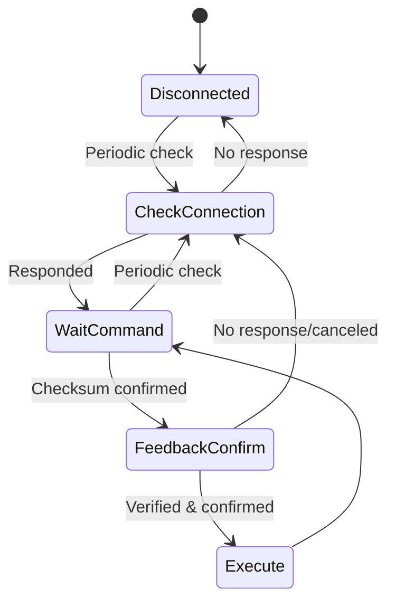
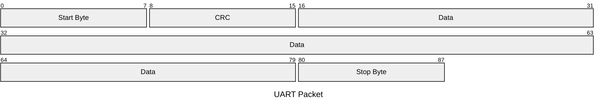

Link to [Chinese Version](https://juntong20xx.github.io/posts/2025/02/10/year-2-project-%E4%B8%8B%E4%BD%8D%E6%9C%BA%E5%BC%80%E5%8F%91.html).

In embedded development, Slave computers typically don't participate in decision-making and serve as actuators or sensors.

In this project, each module functions as a slave computer executing instructions from the host computer.

**Development Setup**  

- Slave computer: Arduino Uno 
- Host computer: Raspberry Pi 5 

## Code Design

**State computer Design**

The slave computer doesn't make decisions and can be treated as a state computer:




#### Communication Protocol Design


- **Physical layer** (Communication Channel): UART over USB  
  
  Advantages:  
  
  - Easy operation  
  - Reliable USB connection  
  
- **Data packet structure** (Encoder-modulator/"Link Layer"):  




- **Application layer** (Message Source): 
  
  Packet size: 16 bytes (designed for Python compatibility, equivalent to two `int` types):  
  
  ```cpp
  struct __attribute__((packed)) STRUCT_Message {
      int32_t msg_type;
      char data[4];
  } Message;
  ```
  
- **Connection protocols**:  
  
  1. `ping`: Test host computer availability  
  2. `wait`: Notify host computer of standby status  
  3. `command`: Instruction execution cycle  

Protocol details available in the Year 2 Project Slave Computer Wiki.

**Debugging Design**

With no display/terminal, the onboard LED indicates status:  
- Blinking: No connection  
- Steady: Connected  

The following figure is a screenshot of the protocol design during development (translated by Google):


## Issues & Solutions
**Serial port occupation during programming**

**Analysis**: Conflict between host computer process and programming process

**Solution**: Manually close host computer process before programming  

**Intermittent connectivity** 

**Analysis**: CRC validation failures (observed via serial debugging)

**Solution**: Track last 8 ping records - consider connected if majority succeed 


## Testing
Connection test: Verify slave computer status changes when host computer starts/stops  


Servo control test: Validate host computer command execution  


Serial message capture: Oscilloscope verification of communication  


Synchronized testing with host computer - see [Host Computer Development Blog](https://juntong20xx.github.io/posts/2025/02/12/Year-2-Project-Host-Computer-Development.html) for details.

