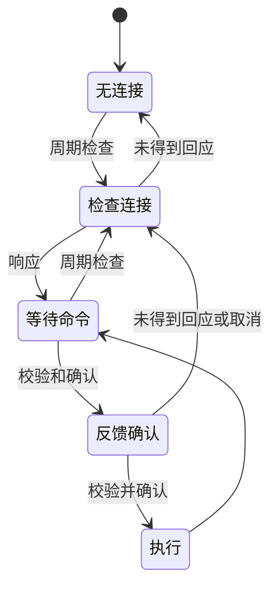
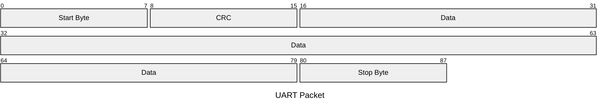

Link to [English Version](https://juntong20xx.github.io/posts/2025/02/10/Year-2-Project-Slave-Computer-Development.html).

在嵌入式开发中，下位机通常不参与决策，作为执行器或传感器使用。

此项目中，每个模块都作为下位机，执行上位机的指令。

开发中，下位机使用 Arduino Uno，上位机使用 Raspberry Pi 5。

## 代码设计

**状态机设计**

下位机不参与决策，可以将其视为状态机。




**通信协议设计**


项目硬件层面（对应图中的 Communication Channel）的通信协议，选择了基于 USB 连接的 UART 通信，其优点如下：

- 易操作
- USB 线保证信道可靠性

在数据包发送前，要对其进行编码（对应图中的 Encoder-modulator 或许可以叫 "链路层"）。项目采用了嵌入式通信中常见的数据结构：





数据层面的通信协议（对应图中 Message Source）根据状态机设计。

- 数据包结构，每个数据包大小为 16 byte 。该设计是出于与上位机的 Python 代码兼容，使得每个包长度正好等于两个 `int` 类型，避免在 Python 中直接操作 ctype 或二进制.

  ```cpp
  struct __attribute__((packed)) STRUCT_Message {
    int32_t msg_type;
    char    data[4];
  } Message;
  ```

- 在数据包之上的连接协议分为三种，`ping` `wait` 和 `command`。`ping` 用于测试上位机是否在线，`wait` 通知上位机当前下位机在等待指令，`command` 是上位机发出指令到下位机返回执行结果的一系列消息。

协议细节请参考 Year 2 Project 下位机的 Wiki.

下图是开发过程中协议设计的截图：


**调试设计**

由于本项目的下位机没有显示屏，也没有终端，因此设备自带的 LED 闪烁表示当前状态。在该版本代码中，LED 闪烁表示与上位机未连接，常量表示与上位机连接。

## 问题和解决

**通信/烧录过程提示串口占用**

分析：上位机进程和烧录进程同时读写串口，导致冲突。

解决：在烧录前手动关闭上位机进程。

**下位机连接时断时续**

分析：在串口打印连接调试信息，发现 CRC 有概率校验失败。

解决：记录近 8 次的 ping 记录，若过半数连接成功，则视为与上位机连接。


## 成品测试

首先测试当上位机启动时，下位机是否显示连接成功，上位机断开后下位机是否切换回无连接状态。

下图中 vs code 终端表示上位机在该时间戳收到了下位机的 ping 消息，并校验成功。


在 ping 测试成功后，尝试通过上位机控制舵机旋转。


在示波器上捕获串口消息：


上位机和下位机的测试是同步的，可以阅读[上位机开发的博文](https://juntong20xx.github.io/posts/2025/02/12/year-2-project-%E4%B8%8A%E4%BD%8D%E6%9C%BA%E5%BC%80%E5%8F%91.html)获取更多信息。

下图是测试时的视频节选：


