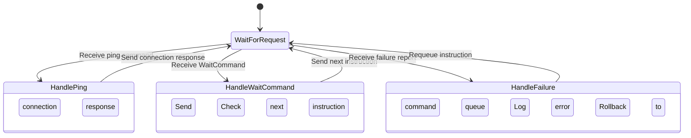

In embedded system development, the upper computer refers to the device that interacts with the lower computer, typically acting as the controller.

In this project, the upper computer uses a Raspberry Pi 5, and the lower computer is an Arduino Uno, connected via USB.

## Code Design

The workflow of the upper computer can be simplified as: responding to lower computer requests.

- Reply with connection confirmation when receiving ping command
- Send instructions from the command queue when receiving WaitCommand 
- Requeue instructions when receiving execution failure reports

Additionally, to package the upper computer as an SDK, we configured pyproject.toml for easy distribution as a Python module.

## Issues & Solutions

### Parameter Parsing Exception
**Analysis**: Lower computer packets only use first 8 bytes as valid data, causing parsing issues in Python's strong typing system which requires handling all 16 bytes.  

**Solution**: Modify lower computer to write zeros in unused bytes.

### Serial Port Not Found  
**Analysis**: Development environment used Linux (Raspberry Pi OS) via VS Code Remote, while debugging used Windows (laptop).  

**Solution**: Add serial port parameter configuration in test code.

## Testing

Created test programs in `/test` directory that:
1. Prompt for serial port address
2. Create command queue using Python built-in list
3. Pass queue and port address to communication function
4. Run as separate thread
5. Enter main loop accepting servo rotation degree inputs

Upper and lower computer testing is synchronized. Refer to the lower computer development blog for more details.

Below is a screenshot from testing video:

