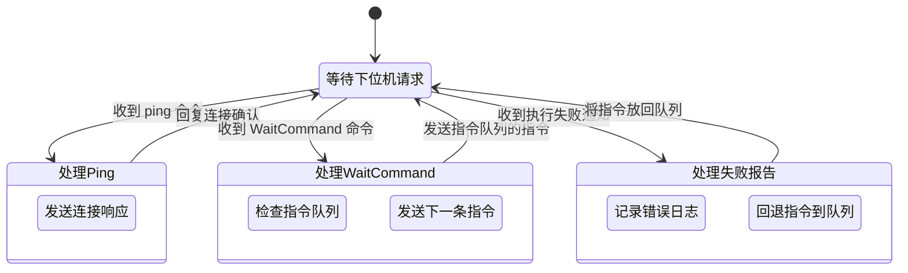

Link to [English Version](https://juntong20xx.github.io/posts/2025/02/12/Year-2-Project-Upper-Computer-Development.html).

在嵌入式开发中，上位机指与下位机交互的设备，通常是下位机的控制者。

在本次开发中，上位机使用的是一块 Raspberry Pi 5, 下位机是一块 Arduino Uno，二者通过 USB 连接。

## 代码设计

在此设计中，上位机的工作内容可以简化为：响应下位机的请求。

- 当收到 `ping` 命令时，回复上位机连接。
- 当收到 `wait command` 命令时，发送指令队列的指令。
- 当下位机报告执行失败，将指令放回指令队列。

此外，考虑到上位机将作为 SDK 提供，设置了 `pyproject.toml` 便于开发结束后打包为 Python 模块发布.

## 问题和解决

**参数解析异常**

问题分析: 下位机部分数据包仅有前 8 byte 为有效信息，因此传输时没有考虑固定长度的数据包后 8 byte 的情况。而 Python 作为强类型语言，必须将后 8 byte 作为某种数据类型进行处理。

解决方案：修改下位机，在传输数据前将无效位写为 0。

**找不到串口**

问题分析：上位机在开发时使用 vs code 远程连接到树莓派（系统为 Linux）上运行，而调试时使用笔记本（系统为 Windows）连接下位机执行。

解决方案：在测试代码中添加连接串口参数。

## 测试

在项目的 `test` 目录中创建测试程序。测试程序通过源代码位置调用了上位机的函数，当测试程序运行时，首先要求用户输入串口地址，之后使用 Python build-in list 创建命令队列，将命令队列和串口地址传给通信函数作为线程运行，启动线程后进入主循环，等待用户输入舵机的旋转度数。

上位机和下位机的测试是同步的，可以阅读下位机开发的博文获取更多信息。

下图是测试时的视频节选：

