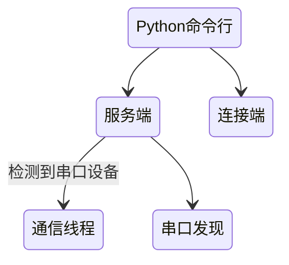

拖了很久，终于搞前端和后端的对接测试了。

## Step 1: 准备测试代码

代码新增的功能是动态支持多个 Arduino 下位机，这个变化在在服务端与连接端均有体现。

首先，上位机的服务端会检测到连接设备的变化启动新的通信线程，每个通信线程相当于原先的服务端。我需要测试服务端是否能正确根据变化控制这些子线程；以及当服务端关闭时，能否正确停止子线程。

另一个则是在连接端将不再直接接触命令队列，所有指令将先编码为 json ，二进制数据通过 Unix Socket 传输给服务端，服务端再进行 json 反序列化，根据解析出的内容执行对应操作——因此连接端的函数参数有所变化，需要为这些函数重新编写测试代码。

> 因为这里服务端和连接端通信都在本地完成，数据甚至不会经过网卡，因此可以认为信道是稳定的，和上位机与下位机的通信不同，这时无需考虑丢包、比特翻转等。

经过如上分析，编写了新的测试代码。

## Step 2: 同步代码

先在开发电脑上把最新的更改提交，然后出现了如下问题。

这次因为在笔记本和台式机上都更新了代码，出现了 JetBrains 配置文件 `.idea/workspace.xml` 的冲突。尽管 PyCharm 自带了 git 管理，但似乎它的工程配置文件并没有处理 git 项目，连个 `.gitignore` 文件都没有。我的解决方案是在一台设备上手动删除该 xml 文件，再进行 `git pull` 操作。

另外还有在树莓派（上位机）中配置运行环境前也发生了由远程开发带来的冲突：我将代码 clone 到本地后，接下来一步是切换到代码文件夹中的 `.venv` 文件夹创建 Python venv 环境（这是我的习惯）。然而执行 `python3 -m venv .venv` 却提示“文件夹不为空”。好吧，我之所以在创建项目时没有屏蔽该目录，是因为看到生成后的 `.venv` 目录下有 `.gitignore` 文件，误以为会处理此时的情况。然而并没有。最后解决方案是先删除克隆下生成的 `.venv` 目录后再创建环境。

教训是新建项目时要屏蔽掉这些工程文件的路径。

> 写本篇博客时，我已经在 git 中删除了这些目录，不再会对未来开发或者使用者造成影响。

## Step 3: 测试过程

测试代码结构如下图所示，图中由高到低表示一个线程：

当没有串口设备连接时，`/dev/serial/by-id` 会被 Linux 系统删除，这会导致服务端的串口设备发现线程因为找不到路径而停止。造成错误的原因是我并不知道此特性。通过添加路径存在检测解决。

通信线程在关闭服务端后没有自动停止。`daemon=True` 仅表示主线程退出时结束子线程，测试时主线程是 Python 解释器的命令行，因此停止服务端线程，这些子线程并不会停止。解决办法是修改通信线程的循环执行条件。

解决这两个问题后，代码测试通过，我提交了新版本号 `v0.1.0`。

最后放一下测试后的照片：

