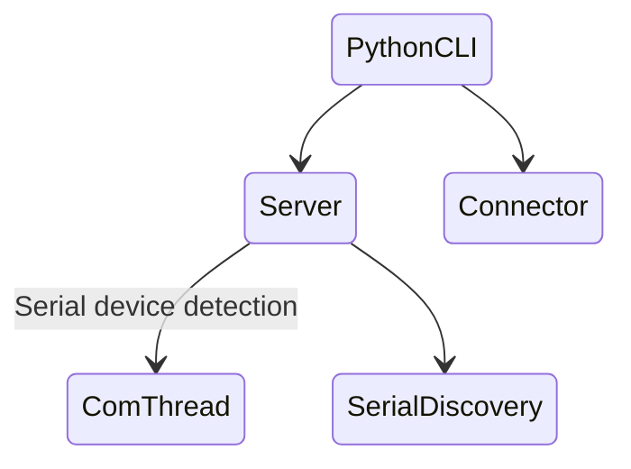

This article documents the integration testing between the new versions of host and slave systems.

## Test Preparation Phase

### Step 1: Equipment Preparation

**Host Machine**

- Reinstall PlatformIO environment on Raspberry Pi 5
- Verify user read/write permissions for window operations before execution

**Slave Devices**  

- Two assembled robotic arms connected via USB to host machine

### Step 2: Test Code Restructuring
**Core modifications**:  
- Added dynamic support for multiple Arduino slave devices  
- New device status monitoring thread on server side  
- JSON encoding + Unix Socket transmission scheme implemented  

**Key test objectives**:  
- Server thread management mechanism verification  
- Command encoding/decoding reliability testing  
- Full-link communication stability verification (local loopback test)

### Step 3: Development Environment Synchronisation Issues
**Observed issues**:  
- IDE configuration file conflicts (`bash .idea/workspace.xml`)  
- Virtual environment creation failure  
  `python3 -m venv .venv → Error: Directory not empty`  

**Solutions**:  
- Manual deletion of conflicting files followed by `git pull`  
- Added `.gitignore` rules for future prevention  
- `rm -rf .venv && python3 -m venv .venv`

## Test Implementation Process

### System Architecture Diagram

## Critical Issue Resolution
**Path detection anomaly**  
- Issue: Dynamic changes in `/dev/serial/by-id` path causing service crashes  
- Solution: Implemented path existence checks  

**Thread lifecycle management**  
- Issue: Communication threads not terminating with server shutdown  
- Solution: Optimised thread loop termination condition checks  

## Test Achievements
- Completed full-link communication verification  
- Implemented dynamic multi-device management  
- Released stable version v0.1.0  

Test environment photo documentation:

