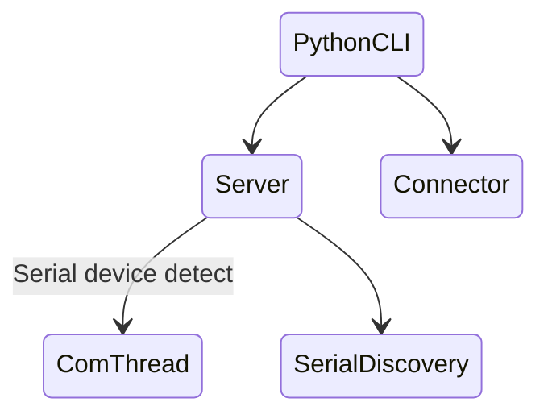

Link to [English Version](https://juntong20xx.github.io/posts/2025/02/22/Year-2-Project-Final-Version-Host-Slave-System-Integration-Testing.html).

这篇文章是上位机和下位机新版本对接测试记录。

## 测试准备阶段

### Step 1: 准备设备

- 上位机

  在 Raspberry Pi 5 重新安装 PlatformIO 环境。运行前检查用户是否有窗口读写权限。

- 下位机

  两个已组装完毕的机械臂，通过 USB 与上位机连接。

### Step 2: 测试代码重构

- **核心改动**：新增多 Arduino 下位机动态支持
  - 服务端新增设备状态监听线程
  - 连接端采用 JSON 编码 + Unix Socket 传输方案
- **测试重点**：
  1. 服务端线程管理机制验证
  2. 连接端指令编解码可靠性测试
  3. 全链路通信稳定性验证（本地环回测试）

### Step 3: 开发环境同步问题

**问题现象**：

1. IDE 配置文件冲突

   ```bash
   .idea/workspace.xml 文件冲突
   ```

   **解决方案**：

   - 手动删除冲突文件后执行 `git pull`
   - 后续添加 `.gitignore` 规则

2. 虚拟环境创建异常

   ```bash
   python3 -m venv .venv → Error: Directory not empty
   ```

   **解决方案**：

   ```bash
   rm -rf .venv && python3 -m venv .venv
   ```

## 测试实施过程

### 系统架构示意图




### 关键问题解决

1. **路径检测异常**
   
   - **现象**：`/dev/serial/by-id` 路径动态变化导致服务崩溃
   - 分析：当没有串口设备连接时，该路径会被移除。
   - **方案**：增加路径存在性检查
   
   
   
2. **线程生命周期管理**
   - **现象**：通信线程未随服务端关闭终止
   - **方案**：优化线程循环终止条件判断

## 测试成果

- 完成全链路通信验证
- 实现多设备动态管理
- 发布稳定版本 `v0.1.0`


---

**测试环境实拍**：  


